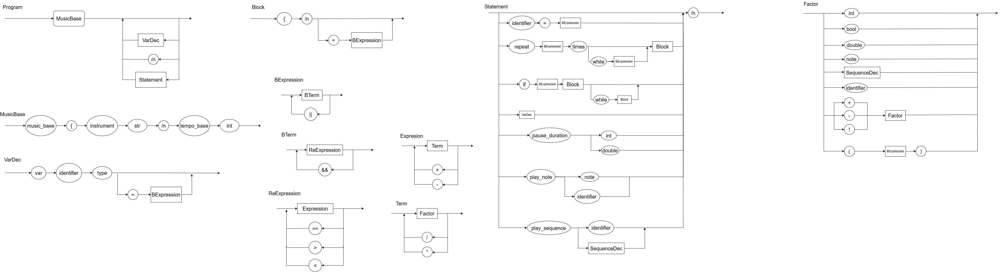

# APSLogComp

### Introdução à Linguagem de Programação Musical MusicLang.

Minha linguagem de programação musical nasceu do desejo de compor trilhas sonoras para jogos de forma mais prática e acessível. Ao invés de depender de programas tradicionais de edição de áudio, criei um jeito de transformar ideias musicais diretamente em código, algo mais próximo do meu dia a dia. Com isso, desenvolvi a MusicLang, uma linguagem de programação fortemente inspirada na linguagem Golang, que permite criar músicas simples e diretas, ideal para quem não tem experiência prévia em composição musical.

#### PDF de apresentação da linguagem

[MusicLang Presentation](MusicLang-PowerPoint.pdf)

Para compilar a linguagem basta estar no ubuntu ou no WSL, ter os requisitos já instalados (VLC Media Player e Clang principalmente) e executar o arquivo `tester.sh` que está na raíz do projeto. Caso não queira executar, você pode visualizar como funciona a linguagem no vídeo: [Execução Music Lang](https://youtu.be/XNod50FGCXs)

- **Motivação**:
  Para a matéria de jogos, não conseguia achar na internet musicas simples que fossem condizentes com a atmosfera do meu jogo. Tentei utilizar softwares de criar música, mas não tinha muita familiaridade. Isso me deu vontade de criar uma linguagem de programação, que é um meio que eu tenho mais contato e mais prática na qual eu pudesse tentar gerar músicas simples

- **Características da linguagem**

  - Definir o instrumento e o tempo:
    Todo código inicia com um setup, onde é possível escolher qual instrumento vai tocar (atualmente, só guitarra) e o tempo base da música.

  - Comandar notas e sequências:
    O usuário pode declarar notas individuais, montar sequências e criar pausas, tudo por meio de comandos claros e diretos. Isso se dá pois há suporte a tipos novos criados como note e sequence.

  - Utilizar estruturas de programação:
    É possível usar variáveis, loops (repeat) e condições (if), facilitando a criação de padrões musicais, repetições e variações.

  - Tocar música de verdade:
    Ao rodar o programa, as instruções são traduzidas para comandos que tocam arquivos .wav no computador usando o Usa VLC, PowerShell e cmd.exe para operação, tornando o código “audível”.

  - Tipagem estática e forte para evitar erros

  - Compilada para LLVM, gerando executável nativo

- **Organização clara e intuitiva:**
  A linguagem usa termos que remetem à música, como note, sequence e pause_duration, o que deixa o código fácil de entender, mesmo para iniciantes.

- **Curiosidades:**

  - Para teste de algumas musicas foi adaptado o código já feito para arduino no repositório https://github.com/robsoncouto/arduino-songs/tree/master

  - Foi utilizado o compilador v3.0 feito na disciplina como base para a criação do compilador musical

  - O compilador gera LLVM, podendo ser rodado em diferentes sistemas e arquiteturas

### EBNF da linguagem

```ebnf
PROGRAM     = SETUP, { ( VARDECL | BLOCK | "\n" ) } ;

SETUP       = "music_base", "{", INSTRUMENT, "\n", TEMPO, { "\n" }, "}" ;

VARDEC     = "var", IDENTIFIER, TYPE, [ "=", EXPRESSION ], "\n" ;

BLOCK       = "{", "\n", { STATEMENT }, "}" ;

STATEMENT   = (
                ASSIGNMENT
              | PLAYNOTE
              | PLAYSEQUENCE
              | PAUSE
              | REPEAT
              | IF
              | VARDEC
              | λ
              ), "\n" ;

ASSIGNMENT  = IDENTIFIER, "=", EXPRESSION ;

PLAYNOTE    = "play_note", ( NOTE | IDENTIFIER ) ;

PLAYSEQUENCE= "play_sequence", ( SEQUENCE | IDENTIFIER ) ;

PAUSE       = "pause_duration", ( NUMBER | IDENTIFIER ) ;

REPEAT      = "repeat", EXPRESSION, "times", [ "while", BEXPRESSION ], BLOCK ;

IF          = "if", BEXPRESSION, BLOCK, [ "else", BLOCK ] ;

NOTE        = "note", NOTE_NAME, "duration", NUMBER ;

INSTRUMENT  = "instrument", STRING ;

TEMPO       = "tempo_base", NUMBER ;

SEQUENCE    = "[", SEQITEM, { SEQSEP, SEQITEM }, "]" ;

SEQITEM     = ( NOTE | IDENTIFIER ), "pause_duration", ( NUMBER | IDENTIFIER ) ;

SEQSEP      = "," ;

BEXPRESSION = BTERM, { "||", BTERM } ;

BTERM       = RELEXPRESSION, { "&&", RELEXPRESSION } ;

RELEXPRESSION = EXPRESSION, { ( "==" | ">" | "<" ), EXPRESSION } ;

EXPRESSION  = TERM, { ("+" | "-"), TERM } ;

TERM        = FACTOR, { ("*" | "/"), FACTOR } ;

FACTOR      = ( "+" | "-" | "!" ), FACTOR
            | IDENTIFIER
            | NUMBER
            | BOOL
            | NOTE
            | SEQUENCE
            | "(", EXPRESSION, ")" ;

NOTE_NAME   = LETTER, [ ACCIDENTAL ], DIGIT ;

TYPE        = "int" | "double" | "bool" | "note" | "sequence" | "string" ;

IDENTIFIER  = LETTER, { LETTER | DIGIT | "_" } ;

STRING      = '"', { CHARACTER }, '"' ;

CHARACTER   = LETTER | DIGIT | "_" ;

NUMBER      = DIGIT, { DIGIT }, [ ".", DIGIT, { DIGIT } ] ;

BOOL      = true | false ;

LETTER      = "A" | "B" | "C" | "D" | "E" | "F" | "G" ;

ACCIDENTAL  = "#" | "b" ;

DIGIT       = "0" | "1" | "2" | "3" | "4" | "5" | "6" | "7" | "8" | "9" ;
```

### Diagrama sintático



### Exemplo simples de código que eu pensei quando estava no processo criativo da linguagem

```plaintext
music_base {
    instrument "guitar"
    tempo_base 120
}

// --- Tipos primitivos ---
var x int = 5
var y double = 3.14
var flag bool = true

// --- Variável note (sem inicialização e com) ---
var n1 note
var n2 note = note E4 duration 0.5

// --- Variável sequence (com e sem inicialização) ---
var seq1 sequence = [note D4 duration 0.4 pause_duration 0.2, n2 pause_duration 0.6]
var seq2 sequence = [n1 pause_duration 1, n2 pause_duration 2]

{// --- Atribuições e expressões ---
    x = x + 2
    y = y * 2.0
    flag = false

    // --- Reatribuição de note ---
    n1 = note A4 duration 1.0

    // --- Play de notas e pausas simples ---
    play_note n1
    pause_duration 1.2

    var seq sequence = [note F4 duration 0.5 pause_duration 0.2, note E4 duration 0.6 pause_duration 0.3]

    // --- Play de sequência literal ---
    play_sequence seq

    // --- Play de sequência via variável ---
    play_sequence seq1

    // --- If / else com bloco ---
    if x > 3 {
        play_note n2
        pause_duration 0.7
    } else {
        play_sequence seq2
    }

    // --- Repeat (x vezes) ---
    repeat 3 times {
        play_note n1
        pause_duration 0.2
    }

    // --- Repeat while (condicional) ---
    repeat 2 times while x < 10 {
        play_sequence [note G4 duration 0.5 pause_duration 0.2, n1 pause_duration 0.6]
        x = x + 1
    }

    // --- Comandos de atribuição dentro de bloco ---

    y = y - 1.0
    x = x * 2


    // --- Testando várias notas, pausas e identifiers em sequence literal ---
    var final_sequence sequence = [note D4 duration 0.5 pause_duration 0.2, n2 pause_duration 1, note A4 duration 0.4 pause_duration 0.1, n1 pause_duration 0.7]
    play_sequence final_sequence

    // --- Operadores booleanos e comparação ---
    flag = (x > 2) && (y < 10)

    if flag {
        pause_duration 2
        play_note note D4 duration 1
        play_note note G4 duration 1
        pause_duration 0.5
    }
}
```
